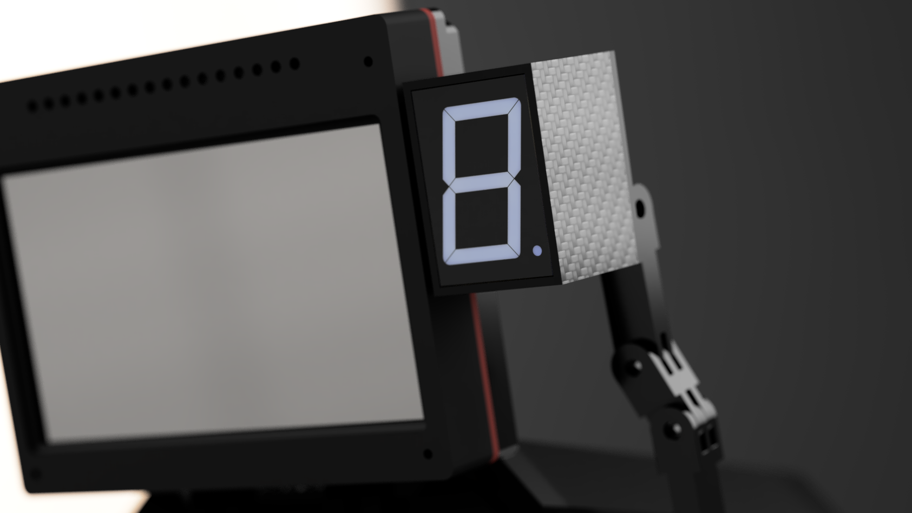

# **GEAR INDICATOR DISPLAY** ⚙️ 

**Tags**:

&nbsp;&nbsp;&nbsp;&nbsp;&nbsp;&nbsp;&nbsp;&nbsp;&nbsp;

---

## **PROJECT DESCRIPTION:**

This project is a **DIY hardware project** and it's a *Gear Indicator* used for **SimRacing**.

The *purpose* of this project is to **improve immersion** while playing *Racing games*.

The necessary components are few and they are **really cheap**.

**No line of code is needed**, as the integration is **handled automatically** by a third party software called *[SimHub](https://www.simhubdash.com/)*.

---

  

### **Features**
- Shows all possible one-digit gears, including **Neutral** (N) and **Reverse** (R).
- **Flashes** while the car is on the redline. *(Optional)*
- **Compatible with all Racing games** thanks to [SimHub](https://www.simhubdash.com/).

## **Ratings**

**Difficulty:** &nbsp;&nbsp;&nbsp;&nbsp;&nbsp;&nbsp;&nbsp;&nbsp;&nbsp;&nbsp;&nbsp;&nbsp;&nbsp; 2/5  ⭐⭐⚫⚫⚫

**Parts needed:** &nbsp;&nbsp;&nbsp;&nbsp;&nbsp;&nbsp; 1/5  ⭐⚫⚫⚫⚫

**Cost:** &nbsp;&nbsp;&nbsp;&nbsp;&nbsp;&nbsp;&nbsp;&nbsp;&nbsp;&nbsp;&nbsp;&nbsp;&nbsp;&nbsp;&nbsp;&nbsp;&nbsp;&nbsp;&nbsp;&nbsp; 1/5  ⭐⚫⚫⚫⚫

**Usefulness:** &nbsp;&nbsp;&nbsp;&nbsp;&nbsp;&nbsp;&nbsp;&nbsp;&nbsp;&nbsp; 2/5  ⭐⭐⚫⚫⚫

**Time needed:** &nbsp;&nbsp;&nbsp;&nbsp;&nbsp;&nbsp; 2/5  ⭐⭐⚫⚫⚫

[//]: # (## REPORT)
[//]: # (Check the report in the repository if avaiable.)

---

## **3D MODELS IMAGES**

### **CASE:**

  
  
  

### **BACK:**

  
  
  

---

### **3D MODEL FILES:**

**All** 3D models files are **available for free** and *can be found in the repository.*

[//]: # (Do you want to have it printed? Click Here.)

## **Wiring diagram**

  

**Hardware components:**
- 1 x Arduino *(Generic)*
- 1 x **74HC595** Shift Register Chip 
- 7 x 220Ohm Resistor  
- 1 x Seven-segment Display LED **COMMON CATHODE** ( 5V ) (1.8 inch)
- 2 x M5 Bolts
- 2 x M5 Nuts
- 1 x 3D Printed Case *(Optional)*

**Necessary tools:**
- Soldering Iron
- 3D Printer *(Optional)*

### **How to assemble it**

1. Follow the **Wiring diagram** and connect the **Pins**: *GND, VCC (5V), 4, 3 and 2* as shown.
2. Connect the **VCC (5V)** to the correct pin of the **Seven-segment Display**.
3. Connect the **Shift Register Chip** to the **Seven-segment Display** and **placing resistors in the middle**.
4. Fix the chip and arduino securely to the back of the display.
5. Insert the components into the *3D printed Case*.
6. **Secure** the components inside the case with a bit of *hot glue* or *super glue*.
7. *Close* the case.
8. Connect Arduino to the PC via USB cable.
9. Install the **latest version** of *[SimHub](https://www.simhubdash.com/)*.
10. *Setup the Gear Indicator Display Via [SimHub](https://www.simhubdash.com/)*.

---

## **GALLERY:**

### **RENDERS**

  
  

  

## **IRL (Project Completed)**

  
  

